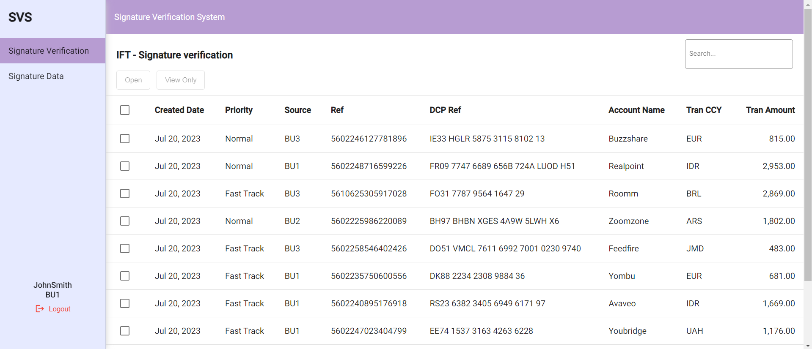

<a id="readme-top"></a>


<!-- PROJECT SHIELDS -->
<!--
*** I'm using markdown "reference style" links for readability.
*** Reference links are enclosed in brackets [ ] instead of parentheses ( ).
*** See the bottom of this document for the declaration of the reference variables
*** for contributors-url, forks-url, etc. This is an optional, concise syntax you may use.
*** https://www.markdownguide.org/basic-syntax/#reference-style-links
-->

[![LinkedIn][linkedin-shield]][linkedin-url]


<!-- PROJECT LOGO -->
<br />
<div align="center">
  <!-- <a href="https://github.com/timothy-odofin/signatureverification">
    
  </a> -->

<h3 align="center">Signature Verification Application</h3>

[//]: # ()

  <p align="center">
    An application that help detects user image signature
    <br />
    <a href="https://github.com/timothy-odofin/signatureverification"><strong>Explore the docs »</strong></a>
    <br />
    <br />
    <a href="https://github.com/timothy-odofin/signatureverification">View Repository</a>
    ·
    <a href="https://github.com/timothy-odofin/signatureverification/issues">Report Bug</a>
    ·
    <a href="https://github.com/timothy-odofin/signatureverification/issues">Request Feature</a>
  </p>

    
</div>


<!-- TABLE OF CONTENTS -->
<details>
  <summary>Table of Contents</summary>
  <ol>
    <li>
      <a href="#about-the-project">About The Project</a>
      <ul>
        <li><a href="#detailed-description">Detailed Description</a></li>
      </ul>
    </li>
    <li>
      <a href="#getting-started">Getting Started</a>
      <ul>
        <li><a href="#prerequisites">Prerequisites</a></li>
        <li><a href="#installation">Installation</a></li>
        <li><a href="#tecgnologies-used">Technologies used</a></li>
        <li><a href="#testing">Testing</a></li>
      </ul>
    </li>
    <li><a href="#web">Web</a></li>
    <li><a href="#security">Security</a></li>
    <li><a href="#contributing">Contributing</a></li>
    <li><a href="#contact">Contact</a></li>
  </ol>
</details>


<!-- ABOUT THE PROJECT -->
## About The Project

This project is a signature verification application, meaning it helps use verify and confirm their image signature after it must havebenn processed by the system.


### Detailed Description
The appplication is a multi-module project with each module addressing different concerns. They communicate by have the other one as a dependency within itself.
The list of module are:
- **Api**: Which is responsible for holding the endpoints, security, exception handling, mapper and application data initialization.
- **Common**: This module simple contains the methods used in the project, such as the utility functions.
- **Domain**: THis is where the Data Transfer Objects (DTOs) in form of responses and request are located. Also, the entities needed for the application are located.
- **Persistence**: This is the repository layer, this module basically is responsible for communication with the database.

In addition to that the application contains a
-  `Dockerfile` responsible for building the application in a docker image.
-  `docker-compose.yml` file responsible for managing(starting and stopping) the application containers.

<p align="right">(<a href="#readme-top">Back to the Top</a>)</p>

<!-- GETTING STARTED -->
## Getting Started

This application is a spring/spring-boot project which runs in a maven environment and packaged into dockers container, and docker-compose to manage it, the project structure is explained here.  
To run the project on the host machine, the following information will be required:
### Prerequisites

- Java 17
- Spring boot 2.0+
- Docker *must* be installed


### Installation

1. Clone the repo
   ```sh
   git clone https://github.com/timothy-odofin/signatureverification.git
   ```
2. Install maven dependencies
   ```sh
   mvn clean install
   ```
3. Run the application
   ```sh
    mvn spring-boot:run
   ```
4. To stop and start the docker container,

    ```bash
      docker-compose up
      docker-compose down
    ```
5. To run the integration test manually
    ```compile
    mvn clean verify 
    ```

6. To run both integration and unit test manually
    ```
    mvn clean build
    ```

<p align="right">(<a href="#readme-top">Back to the Top</a>)</p>

### Technologies Used
* Programming Language(s) and Frameworks
    * Java 17
    * Spring 5.0/Spring boot 2.7
* Dependencies
    * jackson-datatype-jsr310
    * commons-lang3
    * springfox-swagger-ui
    * spring-boot-starter-web
    * lombok
    * springfox-bean-validators
    * spring-dotenv
    * jjwt
    * spring-boot-starter-security
    * pdfbox
* Tools
    * IntelliJ IDEA
* Testing
    * Mockito
    * JUnit 5
    * TestContainer


### Testing
So far different testing has been done on the application, testing such as end-to-end testing, Unit Testing and Integrated Testing.
For the Unit testing, Mockito was used to test each controller or route, the tests are written in the test folder.
Test done on this application
* Unit Testing
* Integrated Testing
* End-to-end Testing


## Web

[//]: # ()

This is the application user interface, it is responsible for receiving requests and delivering responses to the server.
To interact with it, you login as a user, and after which the logged in user will be able to access the dashboard.
From the dashboard user can select which image to verify, the output is displyed in apdf file that comes up on the side of the dashboard. By default, the application comes with some data that will be displayed on the dashboard, the file responsible for that is located in the home directory of the application resource named `event-source.json`

## Security
The application has a security that authenticates the user at the login page and is responsible for token validation using JWT tokens for the back and forth requests. The application is setup with some default user located in `user.json`. These user have the same password which is `test`

<!-- CONTRIBUTING -->
## Contributing

Contributions are what make the open source community such an amazing place to learn, inspire, and create. Any contributions you make are **greatly appreciated**.

If you have a suggestion that would make this better, please fork the repo and create a pull request. You can also simply open an issue with the tag "enhancement".
Don't forget to give the project a star! Thanks again!

1. Fork the Project
2. Create your Feature Branch (`git checkout -b feature/AmazingFeature`)
3. Commit your Changes (`git commit -m 'Add some AmazingFeature'`)
4. Push to the Branch (`git push origin feature/AmazingFeature`)
5. Open a Pull Request

<p align="right">(<a href="#readme-top">Back to the Top</a>)</p>


<!-- CONTACT -->
## Contact

Odofin Timothy
- [Twitter](https://twitter.com/JENDXOR)
- [Email](mailto:odofintimothy@gmail.com)
- [Github](https://github.com/timothy-odofin)


Project Link: [https://github.com/timothy-odofin/signatureverification](https://github.com/timothy-odofin/signatureverification)

<p align="right">(<a href="#readme-top">Back to the Top</a>)</p>


<!-- MARKDOWN LINKS & IMAGES -->
<!-- https://www.markdownguide.org/basic-syntax/#reference-style-links -->


<!-- [issues-shield]: https://img.shields.io/github/issues/github_username/repo_name.svg?style=for-the-badge -->

[linkedin-shield]: https://img.shields.io/badge/-LinkedIn-black.svg?style=for-the-badge&logo=linkedin&colorB=555
[linkedin-url]: https://www.linkedin.com/in/jendxor/


[Angular.io]: https://img.shields.io/badge/Angular-DD0031?style=for-the-badge&logo=angular&logoColor=white
[Angular-url]: https://angular.io/


